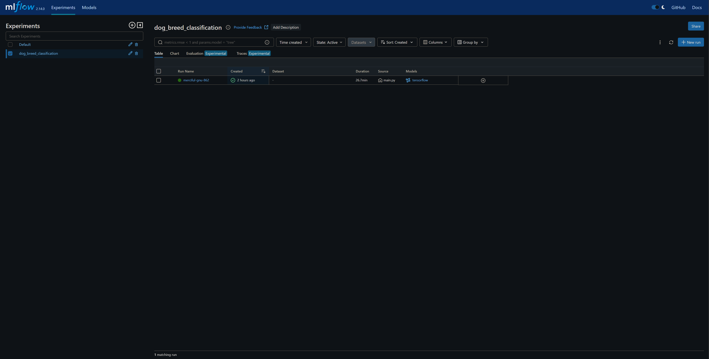

# DOG-BREED-CLASSIFIER

This project is a **deep learning-based classifier** to predict the breed of a dog from an image. The complete pipeline involves **data handling, model training**, and **deployment via Flask API** for predictions. We leverage **AWS Cloud** for storage, **Prefect DAGs** for automation, **Docker** containers for orchestration, and **GitHub workflows** to trigger the system efficiently.

---

## Table of Contents
1. [Project Structure](#project-structure)  
2. [Workflow Overview](#workflow-overview)  
3. [Setup Instructions](#setup-instructions)  
4. [How to Use](#how-to-use)  
5. [Orchestration Process](#orchestration-process)  
6. [Technologies Used](#technologies-used)  
7. [Future Improvements](#future-improvements)  
8. [Contributors](#contributors)

---

## Project Structure

```plaintext
DOG-BREED-CLASSIFIER/
│
├── dags/                  # Prefect DAGs to automate processes
├── data/                  # Directory for data (downloaded & extracted)
├── logs/                  # Logs generated during runs
├── model/                 # Saved models
├── plugins/               # Additional Prefect plugins
├── research/              # Research notebooks or documentation
├── src/                   # Source code files
├── templates/             # HTML templates (for web interface)
├── uploads/               # Uploaded files (images for predictions)
├── venv/                  # Virtual environment
│
├── .dockerignore          # Docker ignore file
├── .env                   # Environment variables
├── .gitignore             # Git ignore file
├── app.py                 # Flask API for predictions
├── docker-compose.yml     # Docker Compose configuration
├── Dockerfile             # Dockerfile to containerize the app
├── main.py                # Main script for data handling & training
├── README.md              # Project documentation (you're reading this)
├── requirements.txt       # Python dependencies
├── setup.py               # Setup configuration
└── template.py            # Template for generating automation scripts
```

---

## Workflow Overview

### 1. **Data Handling on AWS**
   - **Upload:** The dataset is uploaded and stored on **AWS Cloud**.
   - **Download:** We use scripts in the `main.py` to **download the dataset** from AWS.
   - **Extraction:** After downloading, the data is **extracted** and pre-processed.

### 2. **Model Training**
   - **Transformation:** The extracted data undergoes **transformations** (like resizing and normalization).
   - **Deep Learning Model:** A **Convolutional Neural Network (CNN)** is trained on the transformed dataset.
   - **Save Model:** The trained model is then **saved back to AWS** under a different directory for future use.

### 3. **Flask API for Prediction**
   - We use **Flask API** to **load the saved model** and provide a prediction endpoint.  
   - Users can **upload images via the API** to get dog breed predictions.

### 4. **Automation with Prefect DAGs and Docker Orchestration**
   - **DAG:** The `automated_file.py` inside the `dags` folder triggers the entire pipeline, including:
     1. Downloading the dataset
     2. Training the CNN model
     3. Saving the model to AWS
   - **Docker Orchestration:** The DAG also triggers `docker-compose.yml`, which spins up a **Docker container** for running the pipeline.
   - **Linux Environment:** The container creates a **Linux environment** to perform all tasks in isolation.
   - **Orchestration:** This process is managed using **Prefect** for seamless execution.

### 5. **Triggering via GitHub Workflow**
   - **GitHub Workflows** are configured to **automatically trigger the DAGs** on certain events (like code pushes or PRs).
   - This ensures the entire pipeline is executed without manual intervention.

---

## Setup Instructions

1. **Clone the Repository:**
   ```bash
   git clone https://github.com/your-username/dog-breed-classifier.git
   cd dog-breed-classifier
   ```

2. **Create Virtual Environment:**
   ```bash
   python -m venv venv
   source venv/bin/activate   # On Linux/Mac
   venv\Scripts\activate      # On Windows
   ```

3. **Install Dependencies:**
   ```bash
   pip install -r requirements.txt
   ```

4. **Setup AWS Credentials:**
   - Make sure your **AWS credentials** are correctly set up in the `.env` file.

5. **Run Docker Containers:**
   ```bash
   docker-compose up --build
   ```

6. **Monitoring**
   - Using ML Flow for saving artifacts and all the metrics log for selecting best model at production grade.
   ```bash
   mlflow ui
   ```

7. **Access Prefect:**
   - Once the containers are up, access Prefect on `http://localhost:8080` to monitor the DAGs.

---

## How to Use

1. **Upload Data:** 
   - Place your images in the `uploads/` directory or use the **Flask API** to upload directly.

2. **Run Prediction:**
   - Start the Flask API:
     ```bash
     python app.py
     ```
   - Use the following endpoint to get predictions:
     ```http
     POST /predict
     ```
   - Example:
     ```bash
     curl -X POST -F "file=@dog.jpg" http://localhost:5000/predict
     ```

3. **Monitor with Prefect:**
   - Check Prefect UI to monitor DAGs and ensure the pipeline is functioning as expected.

4. **Monitor model metric:**
   - View all the model metric by writing "mlflow ui" in the terminal section which will open a section of mlflow for measuring model performance.
   

---

## Orchestration Process

- **Prefect DAGs:** Handle the scheduling and triggering of tasks.(https://www.prefect.io/)
- **Docker Containers:** Ensure isolated execution and consistency across environments.
- **GitHub Workflows:** Trigger DAGs whenever the repository is updated.

---

## Technologies Used

- **Python**: Core programming language  
- **Flask**: API framework for prediction  
- **AWS Cloud**: For data storage and model saving  
- **Docker**: For containerizing the application  
- **Prefect**: For orchestration and automation  
- **GitHub Actions**: For CI/CD workflows  
- **CNN**: Deep learning model for classification
- **ML flow**: For mesauring model accuract and all the metric logs.

---

## Future Improvements

- **Hyperparameter Tuning**: Automate tuning using frameworks like Optuna.
- **Model Monitoring**: Integrate tools for monitoring model performance.
- **Enhanced API**: Add more endpoints for batch processing and feedback loops.

---

## Contributors

- **Aakash Yadav** - Project Lead  

---

## License

This project is licensed under the MIT License - see the [LICENSE](LICENSE) file for details.
